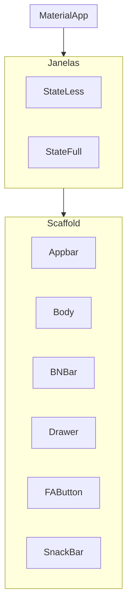

#Relato da Aula de Hoje
##
Hoje a aula foi bem produtiva e prática. A gente começou criando uma conta no GitHub e, em seguida, instalamos o Git no computador. Depois disso, instalamos o VS Code, fizemos todas as configurações necessárias e habilitamos ele pra funcionar direitinho. Também aprendemos a usar o terminal, criando pastas e arquivos por lá, o que ajudou bastante a entender melhor como tudo funciona por trás. Em seguida, sincronizamos o GitHub com o VS Code, vendo na prática como os dois se conectam e facilitam o desenvolvimento. Aprendemos ainda a usar o Live Share dentro do VS Code, que permite compartilhar o código em tempo real com outras pessoas, o que é muito útil para trabalhos em grupo. Para finalizar a aula, escolhemos o representante de sala. No geral, foi uma aula bem completa e importante para dar os primeiros passos na área de desenvolvimento.

## Introdução ao desenvolvimento Mobile

### Tipos de Desenvolvimento
- Nativo
    - Android:
        - SDK : Android SDk
        - IDE : Android Studio
        - Linguagens : Kotlin e Java
        - Ambientes : Mac, Win, Linux

    - IOS 
        - SDK : Cocoa Touch
        - IDE : Xcode
        - Linguagens : Swift / Objectype-C
        - Ambiente : Mac

- Multiplataforma
    - react Natve: 
        - SDk : Node.JS
        - IDE : VSCode
        - Linguagens : JavaScript /TypeScript
        - Ambientes : Mac, Win, Linux 

    - Flutter
        - SDK : Flutter SDK
        - IDE : VSCode, Android Studio
        - Linguagem : Dart
        - Ambientes : Mac,Win, Linux

## Preparação do Ambiente de Desenvolvimento

### Instalação do FlutterSDK
- download do arquivo ZIP na página flutter.dev
- inc## Conteúdo da Aula Anterior

## Introdução ao Desenvolvimento Mobile

### Tipo de Desenvolvimento

- Nativo
    - Android:
        - SDK : Android SDK
        - IDE : Android Studio
        - Linguagens: Kotlin e Java
        - Ambientes: Mac, Win, Linux

    - Ios:
        - SDK: Cocoa Touch
        - IDE: Xcode
        - Liguagens: Swift / Objectype-C
        - Ambientes: Mac

- Multiplataforma
    - React Native:
        - SDK: Node.JS
        - IDE: VSCode, 
        - Linguagens: JavaScript / TypeScript
        - Ambientes: Mac, Win, Linux
    
    - Flutter
        - SDK: Flutter SDK
        - IDE: VSCode, Android Studio
        - Linguagens: Dart
        - Ambientes: Mac, Win, Linux

## Preparação do Ambiente de Desenvolvimento

### Instalação do FlutterSDK
- download do arquivo ZIP na página flutter.dev
- inclusão do flutter na pasta C:\src
- inclusão do flutter\bin nas varáveis de ambiente
- teste o flutter --version

### Instalação do AndroidSDK
- download do Android SDK - Command Line Tools
- adicionar o Command-line ao c:\src\AndroidSDK
- adicionar o SDKManager as Variáveis de Ambiente
- download dos pacotes
    - emulador
    - platforms
    - platform-tools
    - build-tools
- adicionar ADB e o Emulator as Variáveis de Ambiente
- Criação da Imagem do Emulador - via sdkmanager
- Build do Emulador - via sdkmanager

### Criação de Projetos e Códigos da Linha de Comando

- criação de projetos
    - flutter create nome_do_app
        - flags(parâmetros):
            - --empty : Cria um aplicativo "vazio"(hello World!)
            - --platforms : permite a seleção de uma plataforma de desenvolvimento
                - ex: --platforms=android (a criação do projeto será somente para a plataforma android)
    - exemplo de criação de uma aplicativo android vazio
        - flutter create nome_do_app --empty --platforms=android
        - obs: nome do aplicativo: todas as letras minúsculas, separação de palavras com "_";
    - flutter doctor
        - permite correção de pequenos problemas no flutter e identificação dos parâmetros funcionais em relação as plataforma de desenvolvimento
        - sempre rodar o flutter doctor no começo do desenvolvimento
    - flutter clean
        - limpa cache do build(apaga o apk anterior)
    - flutter run -v 
        - build do app (apk)

- gerenciamento de dependências do PubSpec()
    - instalação
        - flutter pub add nome_dependencia
    - baixar e instalar dependências projetadas 
        - flutter pub get
    - outros comando do flutter pub(dependências)
        - flutter pub outdated (verifica se as dependências estão desatualizadas)
        - flutter pub upgrade (atualiza as dependências do flutter pub)

### Estrutura básica de um aplicativo em flutter 

### Árvore de widgets

#### Tipos de janelas 
- StateLess:
    Janelas Imutáveis - Uma vez contruída ela não se altera
    obs: pode ter movimento (GIF, Movies, Carrossel, Cards), mas não consigo alterar as imagens, os videos e os elementos de movimento depois de montados

- StateFull:
    Janelas que permitem mudança de estado (setState)
    obs: Permite adicionar elementos a janela, como novas imagens, novos textos entre outros.

- Comparativo Stateless vs Stateful 

|Caracteristica|Stateless|Stateful|
|-|-|-|
|Mutabilidade| Não | Sim |
|Uso Ideal | Layouts Fixo e Exibição de dados Estáticos | Interações do Usuários, Animações e Dados Dinâmicos|
|Armazenamento de Estado| Não | Sim |
| Método Principal | build() | build()+setState() |

